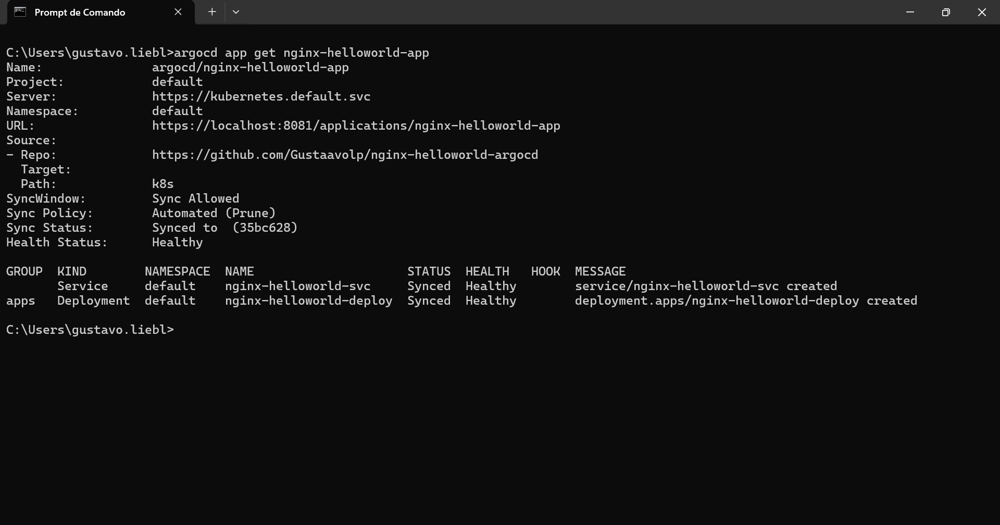
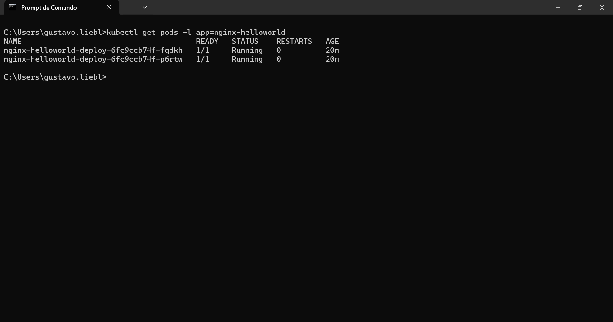
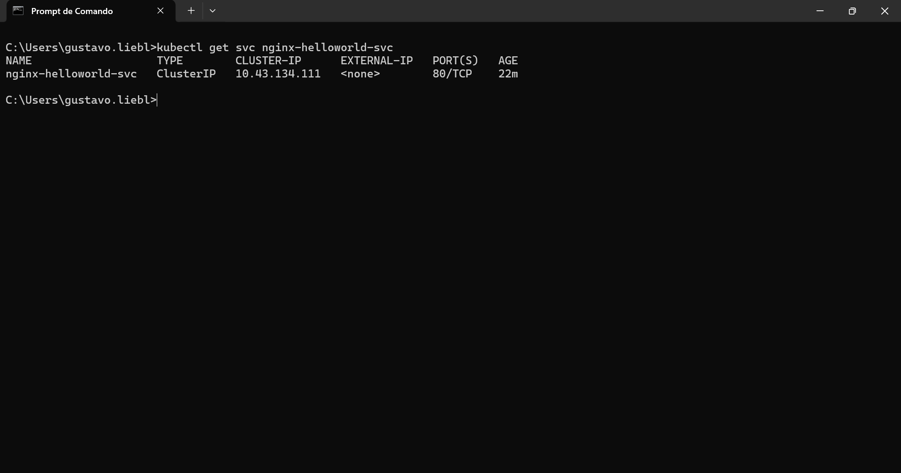
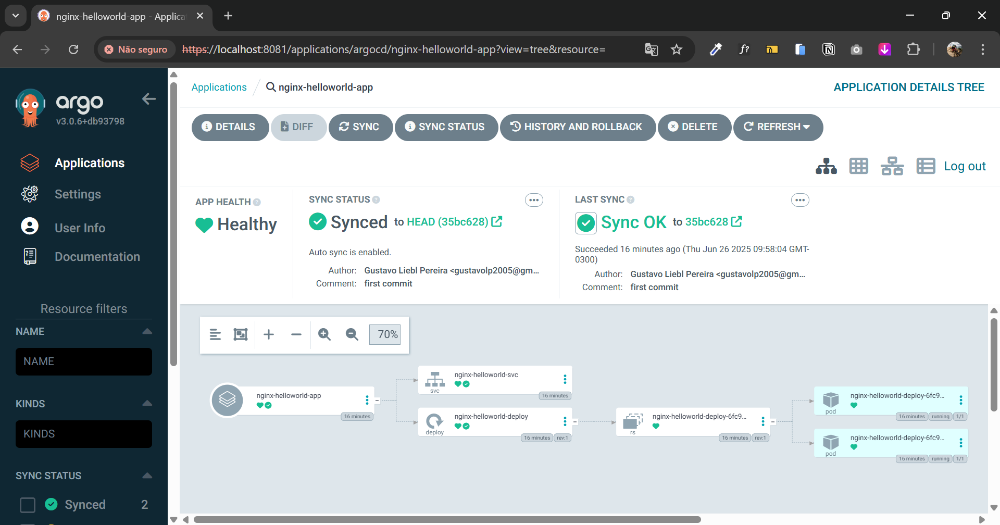
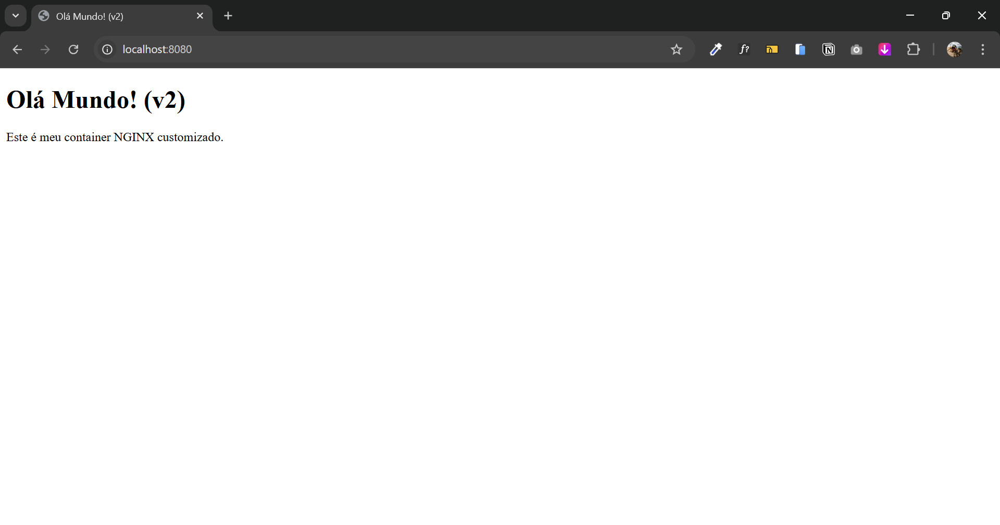

# nginx-helloworld-argocd

Este repositório demonstra como implantar a versão **v2** da aplicação NGINX customizada ("Olá Mundo! (v2)") em um cluster Kubernetes usando **ArgoCD** para GitOps, incluindo geração e publicação de imagens Docker (tags `2.0` e `latest`), manifests Kubernetes e sincronização automática.

## 📋 Pré-requisitos

* Conta no Docker Hub e imagens publicadas: `gustaavolp/nginx-helloworld:2.0` e `:latest`
* Kubernetes cluster configurado (Rancher Desktop)
* `argocd` CLI instalado e acesso ao ArgoCD Server
* Acesso ao ArgoCD Web UI (via port-forward)

## 🚀 Fluxo de Deploy com ArgoCD (v2)

### 1. Aplicar manifests no Git

Neste repositório, os manifests ficam em `k8s/`:

```bash
├── k8s/
│   ├── deployment.yaml  # Deployment v2 (imagem: 2.0)
│   └── service.yaml     # Service ClusterIP
```

Commite e faça push no branch `main`:


### 2. Criar Application no ArgoCD

#### Via CLI:

```bash
argocd login localhost:8081 --insecure --username admin --password <senha>
```
```bash
argocd app create nginx-helloworld-app `
  --repo https://github.com/Gustaavolp/nginx-helloworld-argocd `
  --path k8s `
  --dest-server https://kubernetes.default.svc `
  --dest-namespace default `
  --sync-policy automated `
  --self-heal `
  --auto-prune
```

### 3. Verificar status e saúde

```bash
argocd app get nginx-helloworld-app
```


```bash
kubectl get pods -l app=nginx-helloworld
```


```bash
kubectl get svc nginx-helloworld-svc
```



### 4. ArgoCD Web UI Status


*ArgoCD mostra `Synced` e `Healthy`*

### 5. Acessar localmente via port-forward

```bash
kubectl port-forward svc/nginx-helloworld-svc 8080:80
```

Abra no navegador: [http://localhost:8080](http://localhost:8080)

*Página "Olá Mundo! (v2)" servida pelo Kubernetes*

## 📁 Estrutura do Projeto

```
nginx-helloworld-argocd/
├── html/
    └── index.html               # HTML Customizado
├── docs/
│   └── images/                  # Prints de tela
├── k8s/
│   ├── deployment.yaml          # Configuração do deployment
│   └── service.yaml             # Configuração do serviço
└── README.md                    # Documentação
```
